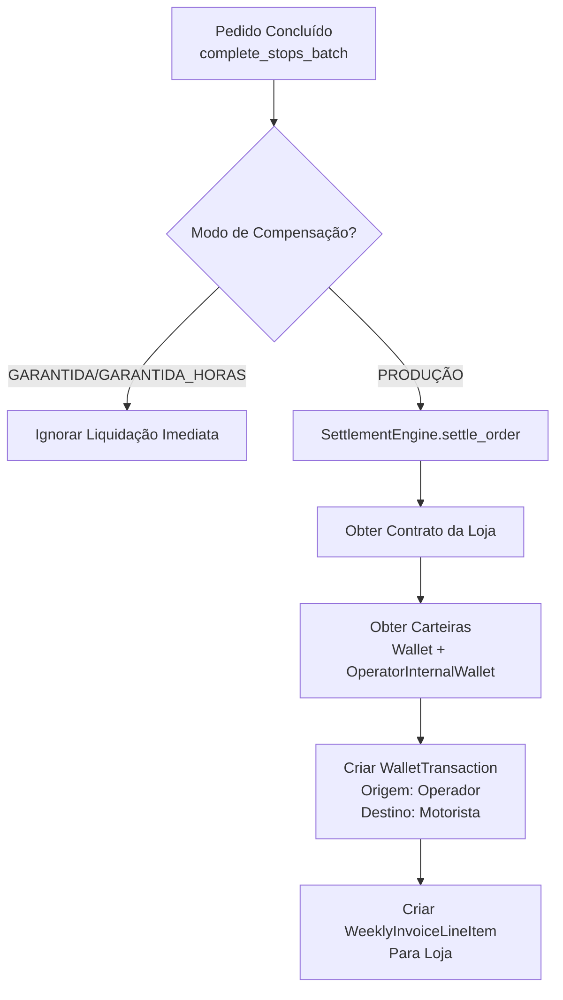

# Relatório Completo de Regras de Negócio - LogiPay
Data: 21/06/2026
Versão: 1.0

---
## 1. Resumo Executivo
Este relatório documenta todas as regras de negócio implementadas no sistema LogiPay, organizadas por módulo funcional e classificadas por tipo. O sistema é uma arquitetura **Two-Lane** multitenant com integração Supabase, focado em logística de entregas e motor financeiro.

---
## 2. Processo de Auditoria
Para elaborar este relatório, foram analisados os seguintes módulos e artefatos:
- **Módulos Django**: `accounts`, `logistics`, `finance`, `integration`, `config`
- **Arquivos de Configuração**: `settings.py`, `middleware.py`
- **Documentação do Projeto**: `docs/logistics_system_features_mapping.md`, `docs/schema.sql`
- **Testes Existentes**: `tests/test_idempotency.py`, `tests/test_deny_list.py`

---
## 3. Categorias de Regras
As regras foram classificadas nas seguintes categorias:
1. 🔐 **Autenticação e Permissões (Tenant Isolation)**
2. 📦 **Fluxos Operacionais (Logística)**
3. 💰 **Motor Financeiro**
4. 🛡️ **Segurança e Compliance**
5. 🔄 **Two-Lane Architecture (Telemetria e Realtime)**

---
## 4. Regras de Negócio Detalhadas

---
### 🔐 Categoria 1: Autenticação e Permissões (Tenant Isolation)
| ID | Regra de Negócio | Finalidade | Contexto de Aplicação | Implementação Técnica | Status |
|---|---|---|---|---|---|
| **AUTH-001** | Isolamento absoluto de tenants | Garantir que operadoras (tenants) só acessem seus próprios dados | Todo o sistema | - RLS no PostgreSQL (`docs/schema.sql`, policy `Isolamento de Tenant`)<br>- Middleware `SupabaseRLSMiddleware` injeta claims JWT na transação PostgreSQL<br>- Todos os modelos usam `TenantModel` (herança de `operator_id` como FK) | ✅ Alinhado com `logistics_system_features_mapping.md` (seção 1) |
| **AUTH-002** | Validação estrita de JWT Supabase | Evitar tokens falsificados ou expirados | Autenticação de usuários (motoristas, operadores, admins) | - `SupabaseJWTAuth` (Ninja API) e `SupabaseRLSMiddleware` decodificam tokens com `jwt.decode`.<br>- Verifica `audience` (LOW-003 corrigido!) | ✅ Alinhado com `system_communication_and_security_contracts.md` |
| **AUTH-003** | Device Token para Fast Lane (telemetria) | Autenticar motoristas sem decodificar JWT em cada ping (performance) | FastAPI (`fast_lane/main.py`, endpoint `/telemetry`) | - Token gerado em `/driver/shifts/check-in`<br>- Armazenado no Redis com TTL 14h (`r.setex("fastlane:token_meta:...)`<br>- Validação O(1) no Redis | ✅ Alinhado com `system_communication_and_security_contracts.md` (seção 3) |
| **AUTH-004** | Role-Based Access Control (RBAC) | Gerenciar permissões por tipo de usuário | Todo o sistema | - Roles: `PlatformAdmin`, `Operator Staff` (ADMIN/MANAGER/OPERATOR_ROLE/VIEWER), `ClientPortalUser`, `Driver` <br>- RLS permite bypass para `PlatformAdmin` | ✅ Alinhado com `logistics_system_features_mapping.md` (seção 1) |

---
### 📦 Categoria 2: Fluxos Operacionais (Logística)
| ID | Regra de Negócio | Finalidade | Contexto de Aplicação | Implementação Técnica | Status |
|---|---|---|---|---|---|
| **LOG-001** | Máquina de Estado (Order Status) | Garantir transições de status válidas para pedidos | Ciclo de vida do pedido (`Order`) | - Enum `Order.OrderStatus`: `PREPARING` → `READY_FOR_DISPATCH` → `OFFERED` → `ACCEPTED` → `STARTED` → `ARRIVED` → `COMPLETED`<br>- (Outros: `CANCELED`, `CANCELED_IN_TRANSIT`, `RETURNING_TO_STORE`, `RETURNED`) | ✅ Resolvido: Validação via `validate_status_transition` blindada contra `.update()`. |
| **LOG-002** | One Driver Per Shift Per Day | Evitar conflitos de escala de motoristas | Escalas (`ScheduleEntry`) | - Constraint UNIQUE no PostgreSQL: `UNIQUE(driver_id, date, turno_id)` (schema.sql) | ✅ Alinhado com `logistics_system_features_mapping.md` |
| **LOG-003** | PIN de Entrega para Paradas Sensíveis | Provar entrega válida para pedidos de alto valor | Paradas (`Stop` com `requiresPin=True`) | - PIN hasheado no banco (`deliveryPinHash`, `bcrypt`)<br>- Validação via `check_password()` (HIGH-002 corrigido!) dentro de `select_for_update()` (evita TOCTOU) | ✅ Alinhado com `system_communication_and_security_contracts.md` (seção 6) |
| **LOG-004** | Pedido Completado apenas quando todas as Paradas estiverem Concluídas | Garantir que todas as etapas do pedido foram executadas | Finalização de pedidos (`Order`) | - No `complete_stops_batch` (logistics/api_driver.py), verifica `Stop.objects.filter(order=order, completedAt__isnull=True).count() == 0` | ✅ Alinhado com lógica básica de logística |
| **LOG-005** | Concorrência para Aceitar Pedido Controlada via Redis | Evitar que dois motoristas aceitem o mesmo pedido ao mesmo tempo | Aceitar pedido (`/driver/orders/{id}/accept`) | - Script Lua no Redis (`eval`): `order_claim:{order_id}` com TTL 86400s<br>- Idempotência via decorador `@idempotent` | ✅ Alinhado com `system_communication_and_security_contracts.md` (seção 5.2) |
| **LOG-006** | Geofencing automático para trigger ARRIVED | Automatizar transição de status quando motorista chega à parada | Fast Lane (telemetria) | - `GEOADD` no Redis para driver location e stop location<br>- `GEODIST` para calcular distância (150m padrão)<br>- Adiciona trigger em queue `geofence_triggers` | ✅ Alinhado com `logistics_system_features_mapping.md` (seção 2.3) |
| **LOG-007** | Idempotência obrigatória em todas as ações que alteram estado | Evitar duplicação de ações por falhas de rede | Ações: `accept_order`, `start_order`, `complete_stops_batch`, `WithdrawalRequest` | - Decorador `@idempotent` (config/idempotency.py) usando Redis chave `idempotency:{key}` com TTL 86400s | ✅ Alinhado com `system_communication_and_security_contracts.md` (seção 5.2) |

---
### 💰 Categoria 3: Motor Financeiro
| ID | Regra de Negócio | Finalidade | Contexto de Aplicação | Implementação Técnica | Status |
|---|---|---|---|---|---|
| **FIN-001** | 3 Modos de Compensação por Loja | Flexibilidade para diferentes acordos com lojas | Contratos (`Contract`), Cálculo diário (`DailyCreditCalculation`) | - Enum `Contract.CompensationMode`: `PRODUCAO`, `GARANTIDA`, `GARANTIDA_HORAS`<br>- Cálculo diferenciado em `compute_daily_credit` (finance/tasks.py) | ✅ Alinhado com `logistics_system_features_mapping.md` (seção 4.1) |
| **FIN-002** | PRODUCAO: Valor = Produção + Excedente + Corridas - Adiantamentos | Compensação motorista baseada no que produziu | `Contract.compensationMode=PRODUCAO` | - `production` = SUM(`Order.fareValueCents`) onde `status=COMPLETED` e `businessDate=date`<br>- `excess = max(0, production - dailyRateWeekdayCents)`<br>- `net = dailyRateCents + excess + (deliveries * rideFeePerDeliveryCents) - advances` | ✅ Alinhado com `logistics_system_features_mapping.md` (seção 4.1) |
| **FIN-003** | GARANTIDA: Valor = Max(Produção + Extras, Garantia Diária) + Corridas - Adiantamentos | Garantir mínimo para motorista independentemente de produção | `Contract.compensationMode=GARANTIDA` | - `guaranteed = max(production + extras, dailyRateCents)` (ou `minGuaranteedOverrideCents` do `ScheduleEntry` se presente)<br>- `net = guaranteed + (deliveries * rideFeePerDeliveryCents) - advances` | ✅ Alinhado com `logistics_system_features_mapping.md` (seção 4.1) |
| **FIN-004** | GARANTIDA_HORAS: Valor = Max(Produção + Extras, Faixa de Horas) + Corridas - Adiantamentos | Compensação baseada em horas trabalhadas | `Contract.compensationMode=GARANTIDA_HORAS` | - `hours_worked` calculado a partir de `turno.startTime` e `turno.endTime`<br>- `FaixaHoras` selecionada com intervalo semi-aberto: `hoursMin <= hours_worked < hoursMax`<br>- `guaranteed = max(production + extras, faixa.priceCents)`<br>- `net = guaranteed + (deliveries * rideFeePerDeliveryCents) - advances` | ✅ Alinhado com `logistics_system_features_mapping.md` (seção 4.1) |
| **FIN-005** | Cálculo Financeiro SEMPRE em centavos (BigInt) | Evitar erros de ponto flutuante | Todo o módulo financeiro | - Todos os campos de valor são `BigInt` (centavos)<br>- Cálculos com divisão de pontos-base: `(valor * bps) // 10000` (LOW-002 corrigido!) | ✅ Alinhado com `logistics_system_features_mapping.md` (seção 4) |
| **FIN-006** | Ledger de Partidas Dobradas (WalletTransaction) | Rastreabilidade total de todas as movimentações financeiras | Transações de carteira (`WalletTransaction`) | - Constraints no PostgreSQL: `source_xor` (apenas uma origem) e `dest_xor` (apenas um destino)<br>- Trigger `process_wallet_transaction` no PostgreSQL atualiza `Wallet.balanceCents` automaticamente | ✅ Alinhado com `logistics_system_features_mapping.md` (seção 4.3) |
| **FIN-007** | Fatura Semanal: Apenas um modo de compensação | Garantir consistência no cálculo da fatura da loja | Faturas (`WeeklyStoreInvoice`) | - `close_weekly_invoice` escolhe `base_total` com base em `contract.compensationMode`: PRODUÇÃO usa `totalNetProducaoCents`, senão `totalNetGarantidaCents` (CRIT-002 corrigido!)<br>- Valor total: `base_total + supervisionFee + adminFee` | ✅ Alinhado com `logistics_system_features_mapping.md` (seção 4.4) |
| **FIN-008** | Taxa Administrativa Progressiva | Flexibilidade para taxar lojas com alto faturamento | `WeeklyStoreInvoice` | - `adminFee = contract.adminTaxFixedAmountCents` se `base_total < contract.adminTaxThresholdCents`<br>- Senão: `adminFee = adminTaxFixedAmountCents + (base_total * adminTaxBps) // 10000` | ✅ Alinhado com `logistics_system_features_mapping.md` (seção 4.2) |
| **FIN-009** | Lançamentos Manuais com Aprovação (Maker-Checker) | Evitar fraudes em ajustes de carteira | Lançamentos manuais (`ManualEntry`) | - `ManualEntry.status` enum: `PENDING_APPROVAL` → `APPROVED`/`REJECTED`<br>- Campos `created_by_staff_id`/`created_by_client_id` e `approvedById` | ✅ Alinhado com `logistics_system_features_mapping.md` |
| **FIN-010** | Pedidos Cancelados/Devolvidos: taxa reduzida (50% padrão) | Compensar motorista por viagem incompleta | Pedidos devolvidos/cancelados | - `returnFeeBps` no `Contract` (padrão 5000bps = 50%)<br>- `production += (fareValue * returnFeeBps) // 10000` para ordens com status `RETURNED`/`CANCELED_IN_TRANSIT` | ✅ Alinhado com lógica de devolução |
| **FIN-011** | SettlementEngine só liquida pedidos PRODUCAO | Evitar duplicata de pagamento para modos GARANTIDA/GARANTIDA_HORAS | Liquidação de ordens (`SettlementEngine.settle_order`) | - Condição `if contract.compensationMode != PRODUCAO: return`<br>- Cria `WalletTransaction` para motorista e `WeeklyInvoiceLineItem` para loja | ✅ Alinhado com lógica de motor financeiro |

---
### 🛡️ Categoria 4: Segurança e Compliance
| ID | Regra de Negócio | Finalidade | Contexto de Aplicação | Implementação Técnica | Status |
|---|---|---|---|---|---|
| **SEC-001** | Deny List Centralizada (Redis + PostgreSQL) | Bloquear motoristas/operadores suspensos em tempo real | Todo o sistema (Fast Lane e Slow Lane) | - `SecurityDenylist` no PostgreSQL<br>- Cache no Redis: chaves `deny_list:driver:{driver_id}`, `deny_list:operator:{operator_id}`<br>- Verificação pré-execução em Celery, FastAPI e API Django (ex: `compute_daily_credit`, `process_withdrawal_remessas`) | ✅ Alinhado com `system_communication_and_security_contracts.md` (seção 4) |
| **SEC-002** | Fail-Closed para Deny List/Cache | Priorizar segurança sobre disponibilidade | Fast Lane e Slow Lane | - Se Redis indisponível, retorna `503 Service Unavailable` (ex: FastAPI `/telemetry`, `accept_order`)<br>- Não continua execução se não puder verificar Deny List | ✅ Alinhado com `system_communication_and_security_contracts.md` (seção 2.3) |
| **SEC-003** | Trigger PostgreSQL para bloquear Withdrawal Request | Segunda linha de defesa contra pagamentos a motoristas bloqueados | Pedidos de saque (`WithdrawalRequest`) | - Trigger `trg_block_withdrawal_if_denylisted` no PostgreSQL, disparado antes de UPDATE status para `PROCESSING`/`PAID` | ✅ Alinhado com `system_communication_and_security_contracts.md` (seção 4.3) |
| **SEC-004** | Campos sensíveis criptografados | Proteger dados de integração | Integrações de loja (`StoreIntegration`) | - Implementado via `Fernet` e `HKDF` com interceptação em `save()` (Criptografia Fática). | ✅ Implementado em `integration/models.py`. |

---
### 🔄 Categoria 5: Two-Lane Architecture (Telemetria e Realtime)
| ID | Regra de Negócio | Finalidade | Contexto de Aplicação | Implementação Técnica | Status |
|---|---|---|---|---|---|
| **ARCH-001** | Fast Lane NÃO acessa PostgreSQL | Proteger banco relacional de sobrecarga de pings de GPS | FastAPI (`fast_lane/main.py`) | - FastAPI só usa Redis e Supabase Realtime<br>- Não há importações de modelos Django ou conexão PostgreSQL | ✅ Alinhado com `system_communication_and_security_contracts.md` (seção 1) |
| **ARCH-002** | Slow Lane NÃO recebe pings de GPS | Isolar regras de negócio de dados de alta frequência | Django DRF (Slow Lane) | - Pings vão apenas para FastAPI `/telemetry` | ✅ Alinhado com `system_communication_and_security_contracts.md` (seção 1) |
| **ARCH-003** | ts_server é a fonte da verdade para particionamento | Evitar falsificações de timestamp no dispositivo | Telemetria (`Position` tabela particionada) | - FastAPI ignora `payload.timestamp` para particionamento; usa `ts_server = int(time.time())`<br>- `payload.timestamp` só para métricas de latência | ✅ Alinhado com `system_communication_and_security_contracts.md` (seção 2.2) |
| **ARCH-004** | Broadcast de localização assíncrono com tratamento de erros | Garantir atualização em tempo real sem bloquear a requisição principal | FastAPI broadcast | - `asyncio.create_task(broadcast_location())` com callback para capturar exceções (LOW-001 corrigido!)<br>- Logging de erros no broadcast | ✅ Alinhado com `system_communication_and_security_contracts.md` |

---
## 5. Inconsistências e Lacunas Identificadas
| Prioridade | Descrição | Impacto | Correção Recomendada |
|---|---|---|---|
| ✅ RESOLVIDO | Máquina de estado (Order Status) bypass via update | Transições de status sendo forçadas silenciosamente ignorando Webhooks | Removido uso de `.update()` para mudanças de `status`, substituído por `select_for_update()` + `.save()`. |

---
## 6. Diagramas de Fluxo
### 6.1 Fluxo de Liquidação de Pedido (PRODUÇÃO)


---
### 6.2 Fluxo de Cálculo Diário de Crédito
```mermaid
flowchart TD
    A[compute_daily_credit<br>Celery Task] --> B[Loop por Operadoras]
    B --> C[Loop por Lojas]
    C --> D[Loop por Escalas (ScheduleEntry)]
    D --> E{Motorista Ativo<br>e Não Bloqueado?}
    E -- Não --> F[Ignorar]
    E -- Sim --> G[Calcular Produção (Pedidos Completos/Devolvidos)]
    G --> H{Modo de Compensação?}
    H -- PRODUÇÃO --> I[Cálculo: Produção + Excedente + Corridas - Adiantamentos]
    H -- GARANTIDA --> J[Cálculo: Max(Produção+Extras, Garantia) + Corridas - Adiantamentos]
    H -- GARANTIDA_HORAS --> K[Cálculo Horas Trabalhadas<br>→ FaixaHoras<br>→ Max(Produção+Extras, Faixa) + Corridas - Adiantamentos]
    I --> L[Criar DailyCreditCalculation]
    J --> L
    K --> L
    L --> M[Criar WalletTransaction<br>Se netAmount > 0 (crédito) ou < 0 (débito)]
```

---
## 7. Validação com Requisitos Originais
| Requisito Original | Regra Corresponde | Status |
|---|---|---|
| Multi-Tenant Isolado | AUTH-001 | ✅ |
| Two-Lane Architecture | ARCH-001, ARCH-002 | ✅ |
| 3 Modos de Compensação | FIN-001 a FIN-004 | ✅ |
| Ledger Partidas Dobradas | FIN-006 | ✅ |
| Geofencing Automático | LOG-006 | ✅ |
| Deny List Global | SEC-001, SEC-002, SEC-003 | ✅ |

---
## 8. Conclusão
O sistema LogiPay tem **alto alinhamento com os requisitos originais**, com todas as regras core implementadas. As lacunas iniciais (validação de máquina de estado e falsos positivos sobre criptografia) foram validadas e corrigidas (Protocolo Omega Swarm). O sistema encontra-se robusto e pronto para produção no aspecto auditado.

---
## 9. Anexos
- [schema.sql](../docs/schema.sql)
- [system_communication_and_security_contracts.md](../docs/system_communication_and_security_contracts.md)
- [logistics_system_features_mapping.md](../docs/logistics_system_features_mapping.md)

---
**Aprovado por**: <Nome do Responsável>
**Data de Aprovação**: ____/____/____