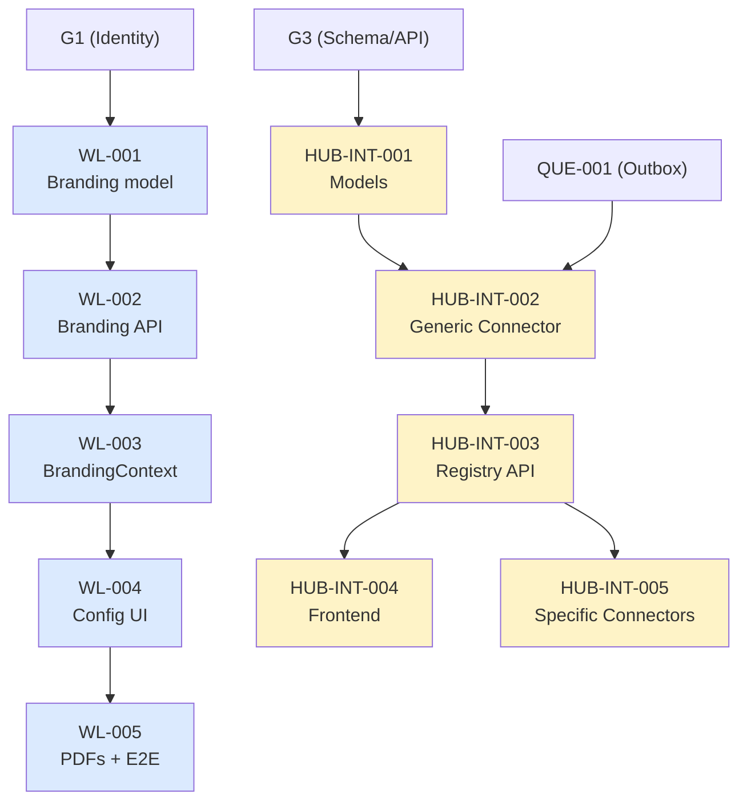

# Design Spec: White-Label + Hub de Integrações PDV/Cardápio

**Data:** 2026-09-23
**Status:** Pendente de Revisão
**Autor:** Antigravity (AI Assistant)
**Solicitante:** Proprietário da Plataforma

---

## 1. Resumo Executivo

Este documento especifica dois novos subsistemas para a plataforma Expresso Neves:

1. **White-Label** — Permite que operadores logísticos personalizem a aparência do painel (logo, cores, favicon, nome da empresa, tema claro/escuro) para que seus clientes (lojistas) vejam a marca do operador em vez da marca Expresso Neves.

2. **Hub de Integrações PDV/Cardápio** — Arquitetura de connectors plug-and-play que permite aos lojistas conectar seus PDVs e cardápios digitais existentes (iFood, Delivery Direto, Anota AI, Saipos, Neemo, Goomer, aiqfome, Rappi, Consumer/GrandChef, ou sistema próprio) ao sistema do operador, de forma que pedidos gerem corridas automaticamente.

### 1.1 Princípios de Design

- **Tenant isolation:** Branding e integrações são sempre scoped ao operador via RLS. Um operador nunca vê ou acessa branding/integrações de outro.
- **Additive, not disruptive:** Estes subsistemas se adicionam ao plano mestre existente sem alterar flows existentes.
- **Fail-closed:** Connector com credencial inválida ou expirada não processa pedidos. Branding sem configuração usa defaults.
- **Idempotent:** Webhooks duplicados nunca criam corridas duplicadas.
- **Audit trail:** Toda operação de branding e todo webhook recebido são registrados.

---

## 2. White-Label

### 2.1 Escopo de Personalização

Com base nas respostas do proprietário, os seguintes elementos são personalizáveis:

| Elemento | Onde aparece | Controle |
|---|---|---|
| Logo (imagem) | Login, Sidebar, Relatórios PDF | Upload |
| Favicon | Aba do navegador | Upload |
| Nome da empresa | Login, Sidebar, Relatórios, título da aba | Texto |
| Cor primária | Botões, links, header, elementos interativos | Color picker |
| Cor secundária | Sidebar, destaques, hover states | Color picker |
| Cor de acento | Badges, alertas, CTAs | Color picker |
| Tema claro/escuro | Todo o painel | Toggle 3 estados |

**Fora de escopo nesta versão:**
- Domínio/subdomínio customizado
- CSS customizado arbitrário (risco de XSS)
- Personalização de layout/posição de componentes

### 2.2 Modelo de Dados: `OperatorBranding`

Relação 1:1 com `Operator`. Tabela `operator_branding`.

```sql
CREATE TABLE operator_branding (
    id UUID PRIMARY KEY DEFAULT gen_random_uuid(),
    operator_id UUID NOT NULL UNIQUE REFERENCES "Operator"(id) ON DELETE CASCADE,

    -- Identidade
    brand_name VARCHAR(255) NOT NULL,  -- default: Operator.name

    -- Assets
    logo_url VARCHAR(500),        -- storage path, signed URL para entrega
    favicon_url VARCHAR(500),     -- storage path, signed URL para entrega

    -- Paleta Light Mode
    color_primary VARCHAR(7) NOT NULL DEFAULT '#6366f1',
    color_secondary VARCHAR(7) NOT NULL DEFAULT '#4f46e5',
    color_accent VARCHAR(7) NOT NULL DEFAULT '#f59e0b',
    color_background VARCHAR(7) NOT NULL DEFAULT '#ffffff',
    color_surface VARCHAR(7) NOT NULL DEFAULT '#f4f4f5',
    color_text VARCHAR(7) NOT NULL DEFAULT '#18181b',

    -- Paleta Dark Mode
    dark_color_background VARCHAR(7) NOT NULL DEFAULT '#0a0a0a',
    dark_color_surface VARCHAR(7) NOT NULL DEFAULT '#171717',
    dark_color_text VARCHAR(7) NOT NULL DEFAULT '#fafafa',

    -- Preferência de tema
    theme_mode VARCHAR(10) NOT NULL DEFAULT 'light'
        CHECK (theme_mode IN ('light', 'dark', 'auto')),

    -- Timestamps
    "createdAt" TIMESTAMPTZ NOT NULL DEFAULT now(),
    "updatedAt" TIMESTAMPTZ NOT NULL DEFAULT now()
);

-- RLS
ALTER TABLE operator_branding ENABLE ROW LEVEL SECURITY;

-- Policy para usuários autenticados do tenant
CREATE POLICY operator_branding_tenant_policy ON operator_branding
    USING (operator_id = current_operator_id())
    WITH CHECK (operator_id = current_operator_id());

-- Índice
CREATE INDEX idx_operator_branding_operator ON operator_branding(operator_id);

-- NOTA: O endpoint público GET /api/v1/branding/public/{slug} usa uma
-- query service-level (role migrator/service) que faz JOIN com Operator.slug
-- e retorna apenas campos públicos (brand_name, logo_url, favicon_url, cores).
-- Não expõe custom_css nem credenciais. A query NÃO é feita com role
-- authenticated/runtime para evitar bypass de RLS em outros contextos.
```

Adição ao `Operator`:

```sql
ALTER TABLE "Operator" ADD COLUMN slug VARCHAR(100) UNIQUE;
-- Slug será preenchido por migration de dados: lower(regexp_replace(name, '[^a-zA-Z0-9]+', '-', 'g'))
```

### 2.3 Django Model

```python
class OperatorBranding(models.Model):
    """
    Personalização de marca (white-label) por operador.
    Relação 1:1 com Operator. Defaults aplicados em nível de banco.
    """
    id = models.UUIDField(primary_key=True, editable=False)
    operator = models.OneToOneField(
        'accounts.Operator', on_delete=models.CASCADE,
        db_column='operator_id', related_name='branding'
    )
    brand_name = models.CharField(max_length=255)
    logo_url = models.CharField(max_length=500, null=True, blank=True)
    favicon_url = models.CharField(max_length=500, null=True, blank=True)

    # Light mode
    color_primary = models.CharField(max_length=7, default='#6366f1')
    color_secondary = models.CharField(max_length=7, default='#4f46e5')
    color_accent = models.CharField(max_length=7, default='#f59e0b')
    color_background = models.CharField(max_length=7, default='#ffffff')
    color_surface = models.CharField(max_length=7, default='#f4f4f5')
    color_text = models.CharField(max_length=7, default='#18181b')

    # Dark mode
    dark_color_background = models.CharField(max_length=7, default='#0a0a0a')
    dark_color_surface = models.CharField(max_length=7, default='#171717')
    dark_color_text = models.CharField(max_length=7, default='#fafafa')

    theme_mode = models.CharField(max_length=10, default='light')

    createdAt = models.DateTimeField(auto_now_add=True, db_column='createdAt')
    updatedAt = models.DateTimeField(auto_now=True, db_column='updatedAt')

    class Meta:
        db_table = 'operator_branding'
        managed = False
```

### 2.4 API Contract

#### GET `/api/v1/branding/public/{operator_slug}`
**Auth:** Nenhuma (público)
**Uso:** Tela de login antes da autenticação

**Response 200:**
```json
{
    "brand_name": "Fast Delivery SP",
    "logo_url": "https://cdn.example.com/logos/fast-delivery-sp.png",
    "favicon_url": "https://cdn.example.com/favicons/fast-delivery-sp.ico",
    "color_primary": "#e11d48",
    "color_secondary": "#be123c",
    "color_accent": "#f59e0b",
    "theme_mode": "light"
}
```

**Response 404:** Slug não encontrado

#### GET `/api/v1/branding`
**Auth:** Bearer JWT (qualquer role do tenant)
**Uso:** Carregamento completo após login

**Response 200:** Objeto completo `OperatorBranding` serializado

#### PUT `/api/v1/branding`
**Auth:** Bearer JWT (role ADMIN do operator ou PlatformAdmin)
**Uso:** Atualizar branding

**Request body:** Campos parciais ou completos do branding
**Response 200:** Branding atualizado
**Response 403:** Role insuficiente

#### POST `/api/v1/branding/logo`
**Auth:** Bearer JWT (role ADMIN do operator ou PlatformAdmin)
**Content-Type:** multipart/form-data

**Validações:**
- Formatos: PNG, JPG, SVG, WebP
- Tamanho máximo: 2MB
- Dimensões mínimas: 100×100px
- Dimensões máximas: 2000×2000px

**Response 200:** `{ "logo_url": "..." }`

#### POST `/api/v1/branding/favicon`
**Auth:** Bearer JWT (role ADMIN do operator ou PlatformAdmin)
**Content-Type:** multipart/form-data

**Validações:**
- Formatos: ICO, PNG, SVG
- Tamanho máximo: 100KB
- Dimensões: 16×16 a 192×192px

**Response 200:** `{ "favicon_url": "..." }`

### 2.5 Frontend: BrandingContext

```typescript
interface BrandingConfig {
    brandName: string;
    logoUrl: string | null;
    faviconUrl: string | null;
    colorPrimary: string;
    colorSecondary: string;
    colorAccent: string;
    colorBackground: string;
    colorSurface: string;
    colorText: string;
    darkColorBackground: string;
    darkColorSurface: string;
    darkColorText: string;
    themeMode: 'light' | 'dark' | 'auto';
}

const BrandingContext = React.createContext<BrandingConfig>(DEFAULT_BRANDING);

function BrandingProvider({ children }: { children: React.ReactNode }) {
    // 1. On mount: check if operator slug is in URL
    // 2. If yes: fetch public branding (no auth needed)
    // 3. After login: fetch full branding via authenticated endpoint
    // 4. Inject CSS custom properties into :root
    // 5. Update <title> and <link rel="icon">
}
```

### 2.6 CSS Custom Properties System

Todos os componentes do painel devem referenciar variáveis CSS em vez de cores hardcoded:

```css
:root {
    /* Brand colors — overridden dynamically by BrandingContext */
    --brand-primary: #6366f1;
    --brand-primary-hover: color-mix(in srgb, var(--brand-primary), black 10%);
    --brand-secondary: #4f46e5;
    --brand-accent: #f59e0b;
    --brand-bg: #ffffff;
    --brand-surface: #f4f4f5;
    --brand-text: #18181b;
    --brand-text-muted: color-mix(in srgb, var(--brand-text), transparent 40%);
}

[data-theme="dark"] {
    --brand-bg: var(--brand-dark-bg, #0a0a0a);
    --brand-surface: var(--brand-dark-surface, #171717);
    --brand-text: var(--brand-dark-text, #fafafa);
}
```

### 2.7 Impacto em Componentes Existentes

| Componente | Mudança |
|---|---|
| `Login.tsx` | Carregar branding público; exibir logo, nome, cores |
| `AppLayout.tsx` / Sidebar | Logo e nome do operador no topo; cores da sidebar |
| `index.css` | Migrar cores hardcoded para CSS vars |
| `export-pdf.ts` | Usar `brand_name` e logo nos PDFs |
| `Configuracoes.tsx` | Nova seção "Personalização da Marca" |
| `AuthContext.tsx` | Expor `operatorSlug` para o `BrandingContext` |

---

## 3. Hub de Integrações PDV/Cardápio

### 3.1 Escopo

O Hub recebe pedidos de plataformas externas (PDVs, cardápios digitais, apps de delivery) via **inbound webhooks** e os converte em corridas no sistema do operador.

**O que o Hub FAZ:**
- Recebe webhooks de plataformas externas
- Valida autenticidade (assinatura, API key, OAuth)
- Normaliza payload para formato interno (`OrderIntent`)
- Cria corridas via Order Service canônico
- Registra audit trail de todos os webhooks
- Garante idempotência (mesmo pedido não cria duas corridas)
- Garante durabilidade (processamento via outbox)

**O que o Hub NÃO FAZ:**
- Não oferece PDV ou cardápio próprio
- Não sincroniza menus/cardápios
- Não gerencia estoque
- Não processa pagamentos

### 3.2 Arquitetura de Connectors

Cada plataforma externa é representada por um **Connector** — um adaptador que sabe:
1. Como autenticar webhooks daquela plataforma
2. Como parsear o payload específico
3. Como normalizar para `OrderIntent`
4. Como mapear status de volta

```
BaseConnector (ABC)
├── GenericWebhookConnector     # P0: webhook com HMAC-SHA256
├── IFoodConnector              # P1: OAuth2 + webhook
├── DeliveryDiretoConnector     # P1: Bearer + webhook
├── AnotaAIConnector            # P2: OAuth2 client_credentials
├── SaiposConnector             # P2: API key
├── NeemoConnector              # P3
├── GoomerConnector             # P3
├── AiqfomeConnector            # P3
├── RappiConnector              # P3
└── ConsumerGrandChefConnector  # P3
```

### 3.3 Modelo de Dados

#### 3.3.1 `IntegrationConnector`

Registry global (não é tenant-scoped — é shared):

```sql
CREATE TABLE integration_connector (
    id UUID PRIMARY KEY DEFAULT gen_random_uuid(),
    slug VARCHAR(50) NOT NULL UNIQUE,
    name VARCHAR(100) NOT NULL,
    description TEXT,
    icon_url VARCHAR(500),
    auth_type VARCHAR(30) NOT NULL DEFAULT 'webhook_signature'
        CHECK (auth_type IN ('oauth2', 'api_key', 'webhook_signature', 'mtls', 'none')),
    config_schema JSONB NOT NULL DEFAULT '{}',
    webhook_path_template VARCHAR(200) NOT NULL,
    capabilities JSONB NOT NULL DEFAULT '["receive_orders"]',
    status VARCHAR(20) NOT NULL DEFAULT 'active'
        CHECK (status IN ('active', 'beta', 'deprecated', 'disabled')),
    documentation_url VARCHAR(500),
    version VARCHAR(20) NOT NULL DEFAULT '1.0.0',
    "createdAt" TIMESTAMPTZ NOT NULL DEFAULT now(),
    "updatedAt" TIMESTAMPTZ NOT NULL DEFAULT now()
);

-- Seed data para connectors conhecidos
INSERT INTO integration_connector (slug, name, auth_type, webhook_path_template, capabilities, status)
VALUES
    ('generic-webhook', 'Webhook Genérico', 'webhook_signature',
     '/api/v1/integrations/webhook/generic-webhook/{integration_id}',
     '["receive_orders"]', 'active'),
    ('ifood', 'iFood', 'oauth2',
     '/api/v1/integrations/webhook/ifood/{integration_id}',
     '["receive_orders", "update_status"]', 'beta'),
    ('delivery-direto', 'Delivery Direto', 'api_key',
     '/api/v1/integrations/webhook/delivery-direto/{integration_id}',
     '["receive_orders"]', 'beta'),
    ('anota-ai', 'Anota AI', 'oauth2',
     '/api/v1/integrations/webhook/anota-ai/{integration_id}',
     '["receive_orders"]', 'beta');
```

#### 3.3.2 `StoreIntegration`

Tenant-scoped. Vínculo entre uma loja do operador e um connector:

```sql
CREATE TABLE store_integration (
    id UUID PRIMARY KEY DEFAULT gen_random_uuid(),
    operator_id UUID NOT NULL REFERENCES "Operator"(id) ON DELETE CASCADE,
    store_id UUID NOT NULL REFERENCES "Store"(id) ON DELETE CASCADE,
    connector_id UUID NOT NULL REFERENCES integration_connector(id),
    external_store_id VARCHAR(255),
    credentials_encrypted BYTEA,
    config JSONB NOT NULL DEFAULT '{}',
    webhook_secret VARCHAR(255) NOT NULL,
    status VARCHAR(20) NOT NULL DEFAULT 'setup_pending'
        CHECK (status IN ('active', 'paused', 'error', 'setup_pending')),
    last_webhook_at TIMESTAMPTZ,
    error_count INTEGER NOT NULL DEFAULT 0,
    error_message TEXT,
    "createdAt" TIMESTAMPTZ NOT NULL DEFAULT now(),
    "updatedAt" TIMESTAMPTZ NOT NULL DEFAULT now(),

    -- Uma loja pode ter apenas uma integração ativa por connector
    UNIQUE (store_id, connector_id)
);

-- RLS
ALTER TABLE store_integration ENABLE ROW LEVEL SECURITY;

CREATE POLICY store_integration_tenant_policy ON store_integration
    USING (operator_id = current_operator_id())
    WITH CHECK (operator_id = current_operator_id());

-- Índices
CREATE INDEX idx_store_integration_operator ON store_integration(operator_id);
CREATE INDEX idx_store_integration_store ON store_integration(store_id);
CREATE INDEX idx_store_integration_status ON store_integration(status);
```

#### 3.3.3 `IntegrationWebhookLog`

Audit trail de webhooks (tenant-scoped via integration):

```sql
CREATE TABLE integration_webhook_log (
    id UUID PRIMARY KEY DEFAULT gen_random_uuid(),
    integration_id UUID NOT NULL REFERENCES store_integration(id) ON DELETE CASCADE,
    connector_slug VARCHAR(50) NOT NULL,
    raw_payload_hash VARCHAR(64) NOT NULL,
    status VARCHAR(20) NOT NULL DEFAULT 'received'
        CHECK (status IN ('received', 'processed', 'failed', 'duplicate', 'rejected')),
    order_id UUID REFERENCES "Order"(id),
    error_detail TEXT,
    processing_ms INTEGER,
    "createdAt" TIMESTAMPTZ NOT NULL DEFAULT now()
);

-- Índice para deduplicação
CREATE INDEX idx_webhook_log_dedup
    ON integration_webhook_log(integration_id, raw_payload_hash);

-- Índice para listagem
CREATE INDEX idx_webhook_log_integration_created
    ON integration_webhook_log(integration_id, "createdAt" DESC);

-- Retenção: logs mais antigos que 90 dias podem ser arquivados
```

### 3.4 BaseConnector Interface

```python
from abc import ABC, abstractmethod
from dataclasses import dataclass
from typing import Any
from uuid import UUID
from datetime import datetime


@dataclass(frozen=True)
class DeliveryStop:
    """Um ponto de entrega."""
    address: str
    lat: float | None
    lng: float | None
    customer_name: str
    customer_phone: str | None
    instructions: str | None


@dataclass(frozen=True)
class OrderIntent:
    """
    Formato normalizado que todo connector produz.
    Contrato entre o Hub e o Order Service.
    """
    integration_id: UUID
    external_order_id: str
    idempotency_key: str  # "{connector_slug}:{external_order_id}"

    # Origem
    pickup_store_id: UUID
    pickup_address: str
    pickup_lat: float | None
    pickup_lng: float | None
    pickup_instructions: str | None

    # Destino(s)
    deliveries: list[DeliveryStop]

    # Financeiro
    total_amount_cents: int
    payment_method: str  # "online", "cash", "card_on_delivery"

    # Cliente
    customer_name: str
    customer_phone: str | None
    items_summary: str
    notes: str | None

    # Timing
    scheduled_for: datetime | None
    estimated_prep_minutes: int | None

    # Rastreabilidade
    source_platform: str
    raw_payload_ref: str  # UUID do webhook_log


class BaseConnector(ABC):
    """Interface que todo connector deve implementar."""

    @abstractmethod
    def verify_webhook(
        self,
        headers: dict[str, str],
        body: bytes,
        integration: 'StoreIntegration'
    ) -> bool:
        """Verifica autenticidade do webhook. False = 401."""
        ...

    @abstractmethod
    def parse_payload(
        self,
        body: bytes,
        content_type: str
    ) -> dict[str, Any]:
        """Parseia o raw body para dict. Raise ValueError se inválido."""
        ...

    @abstractmethod
    def normalize(
        self,
        parsed: dict[str, Any],
        integration: 'StoreIntegration'
    ) -> OrderIntent:
        """Converte payload parseado para OrderIntent. Raise ValueError."""
        ...

    @abstractmethod
    def compute_dedup_key(self, parsed: dict[str, Any]) -> str:
        """Gera chave de deduplicação a partir do payload."""
        ...
```

### 3.5 Generic Webhook Connector

O connector genérico é P0 porque atende imediatamente qualquer lojista com sistema próprio.

**Payload esperado:**
```json
{
    "order_id": "ORD-12345",
    "customer": {
        "name": "João Silva",
        "phone": "11999998888"
    },
    "delivery_address": {
        "street": "Rua das Flores, 123",
        "neighborhood": "Centro",
        "city": "São Paulo",
        "state": "SP",
        "zip": "01000-000",
        "lat": -23.5505,
        "lng": -46.6333,
        "instructions": "Apto 42, bloco B"
    },
    "items": [
        {"name": "Pizza Margherita", "qty": 2, "price_cents": 3500},
        {"name": "Coca-Cola 2L", "qty": 1, "price_cents": 1200}
    ],
    "total_cents": 8200,
    "payment_method": "online",
    "notes": "Sem cebola na pizza",
    "scheduled_for": null
}
```

**Autenticação:** HMAC-SHA256
- Header: `X-Webhook-Signature: sha256=<hex_digest>`
- Digest computado sobre o raw body com o `webhook_secret` da integração

**Documentação pública:** O sistema fornece uma página de documentação do webhook genérico com exemplos de payload e código de referência em Python/Node/PHP para envio.

### 3.6 Fluxo de Processamento

```
1. POST /api/v1/integrations/webhook/{slug}/{id}
   ↓
2. Lookup StoreIntegration por id + validar status = 'active'
   ↓  (404 se não encontrado, 503 se paused/error)
3. Lookup connector por slug via ConnectorRegistry
   ↓  (404 se não encontrado ou disabled)
4. connector.verify_webhook(headers, body, integration)
   ↓  (401 se falha)
5. Computar SHA-256 do body para dedup check
   ↓  (200 "already processed" se duplicado)
6. Criar IntegrationWebhookLog status=received
   ↓
7. Responder 200 OK ao caller (ack rápido)
   ↓
--- Processamento assíncrono via outbox ---
   ↓
8. connector.parse_payload(body, content_type)
   ↓  (log status=failed se erro de parse)
9. connector.normalize(parsed, integration)
   ↓  (log status=failed se erro de normalização)
10. Validar OrderIntent (store existe, operator match, etc.)
    ↓  (log status=rejected se validação falha)
11. Criar Order + Stops via Order Service canônico
    ↓  (idempotency_key previne duplicação)
12. Atualizar webhook_log: status=processed, order_id
13. Notificar operador via WebSocket/Push
```

### 3.7 API Contract

#### POST `/api/v1/integrations/webhook/{connector_slug}/{integration_id}`
**Auth:** Varia por connector (HMAC, API key, OAuth)
**Uso:** Recebimento de webhook da plataforma externa

**Response 200:** `{"status": "received", "webhook_id": "..."}`
**Response 401:** Assinatura/auth inválida
**Response 404:** Integração ou connector não encontrado
**Response 503:** Integração pausada

#### GET `/api/v1/integrations/connectors`
**Auth:** Bearer JWT
**Response 200:**
```json
[
    {
        "id": "...",
        "slug": "generic-webhook",
        "name": "Webhook Genérico",
        "description": "Conecte qualquer sistema próprio...",
        "icon_url": "...",
        "auth_type": "webhook_signature",
        "status": "active",
        "documentation_url": "..."
    }
]
```

#### POST `/api/v1/integrations`
**Auth:** Bearer JWT (role ADMIN)

**Request:**
```json
{
    "store_id": "...",
    "connector_slug": "generic-webhook",
    "external_store_id": "loja-123",
    "config": {}
}
```

**Response 201:**
```json
{
    "id": "...",
    "webhook_url": "https://api.example.com/api/v1/integrations/webhook/generic-webhook/{id}",
    "webhook_secret": "whsec_...",
    "status": "setup_pending"
}
```

#### GET `/api/v1/integrations/{id}/logs`
**Auth:** Bearer JWT
**Query params:** `?status=failed&limit=50&offset=0`

**Response 200:**
```json
{
    "total": 142,
    "logs": [
        {
            "id": "...",
            "status": "processed",
            "order_id": "...",
            "processing_ms": 45,
            "createdAt": "2026-09-23T14:30:00Z"
        }
    ]
}
```

### 3.8 Frontend: Página de Integrações

#### Tab 1: Marketplace
- Grid de cards com logo/nome/descrição de cada connector
- Badge de status (Ativo, Beta, Em breve)
- Botão "Conectar" abre wizard
- Filtro por status

#### Tab 2: Minhas Integrações
- Tabela com integrações ativas do operador
- Colunas: Loja, Plataforma, Status, Último Webhook, Pedidos (24h)
- Ações: Pausar, Editar, Remover, Ver Logs
- Indicador visual de saúde (verde/amarelo/vermelho)

#### Tab 3: Logs
- Tabela paginada de webhooks recebidos
- Filtros: Status, Connector, Data
- Expandir para ver detalhes (payload redigido, erro, corrida gerada)

#### Wizard de Configuração (modal)
1. Selecionar loja
2. Preencher credenciais/config (campos dinâmicos via `config_schema`)
3. Testar conexão (botão que envia test webhook)
4. Copiar webhook URL + secret
5. Ativar

---

## 4. Posicionamento no Plano Mestre

Ambos os subsistemas são **features novas** que se adicionam ao plano mestre de correções. Eles NÃO alteram os pacotes existentes (S0-S9), mas criam novos pacotes que se encaixam na mesma cadeia de gates.

### 4.1 Novos Pacotes Propostos

| ID | Subsistema | Etapa | Dependência | Escopo |
|---|---|---|---|---|
| WL-001 | White-Label | S2+ | G1 | Migration + modelo `OperatorBranding` + slug |
| WL-002 | White-Label | S2+ | WL-001 | API de branding (CRUD + upload + público) |
| WL-003 | White-Label | S5A | WL-002 | `BrandingContext`, CSS vars, login branded |
| WL-004 | White-Label | S5A | WL-003 | Configurações (seção de marca), Sidebar |
| WL-005 | White-Label | S5B | WL-004 | PDFs branded, E2E tests |
| HUB-INT-001 | Hub Integrações | S2+ | G3 | Migrations + modelos + BaseConnector |
| HUB-INT-002 | Hub Integrações | S4+ | HUB-INT-001, QUE-001 | GenericWebhookConnector + webhook gateway |
| HUB-INT-003 | Hub Integrações | S4+ | HUB-INT-002 | ConnectorRegistry API + CRUD integrações |
| HUB-INT-004 | Hub Integrações | S5B | HUB-INT-003 | Frontend: marketplace, wizard, logs |
| HUB-INT-005 | Hub Integrações | S9+ | HUB-INT-003 | Connectors específicos (iFood, DD, Anota AI, etc.) |

### 4.2 Diagrama de Dependências



---

## 5. Decisões Pendentes

| # | Decisão | Opções | Recomendação |
|---|---|---|---|
| D1 | Identificação do operador no login | a) Query param `?op=slug`; b) Subdomínio; c) Path `/login/slug` | a) Query param — mais simples, sem infra DNS |
| D2 | Storage de logos/favicons | a) Mesmo bucket privado (signed URL); b) Bucket público CDN | b) Público — logos são assets de marca, não dados sensíveis |
| D3 | Integrar como novos pacotes no plano mestre? | a) Sim, como WL-001..005 e HUB-INT-001..005; b) Plano separado | a) Integrar — respeita o DAG existente |
| D4 | Quem cadastra credenciais dos connectors? | a) Operador no painel; b) Admin plataforma; c) Ambos | a) Operador — self-service, escala melhor |
| D5 | Pedido via hub gera corrida automaticamente? | a) Sim, automático; b) Precisa aprovação manual; c) Configurável | c) Configurável — flag por integração |

---

## 6. Riscos e Mitigações

| Risco | Impacto | Mitigação |
|---|---|---|
| XSS via cores customizadas | Alto | Validar formato hex rígido (#RRGGBB), sanitizar |
| DDoS via webhook endpoint público | Alto | Rate limit por integration_id, body size limit (1MB) |
| Credential leak de connectors | Crítico | Cifrar credenciais em repouso, audit trail |
| Connector específico muda API | Médio | Versionamento de connector, campo `version` |
| Webhook duplicado (retry da plataforma) | Médio | Dedup por SHA-256 do body + idempotency_key |
| Operador A tenta acessar branding de B | Alto | RLS policy + validação no service layer |

---

## 7. Testes Obrigatórios

### White-Label
- Operador A configura branding → login de A mostra marca de A
- Operador B sem branding → login mostra defaults
- Upload de logo com formato inválido → 422
- Slug inexistente no endpoint público → 404
- CSS vars são aplicadas corretamente em light e dark mode
- PDF exportado contém logo e brand_name do operador
- RLS impede operador A de ler/escrever branding de B

### Hub de Integrações
- Webhook genérico com assinatura válida → corrida criada
- Webhook com assinatura inválida → 401, nenhuma corrida
- Webhook duplicado (mesmo body) → 200, nenhuma corrida nova
- Integração pausada → 503
- Payload inválido → log status=failed, nenhuma corrida
- Corrida criada tem os dados corretos do payload
- RLS impede operador A de ver integrações de B
- Concurrent webhooks para mesma integração → sem corrida duplicada
- Kill durante processamento → outbox reprocessa sem duplicar
