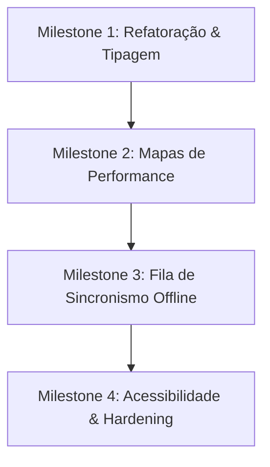

# Roadmap de Produto e Auditoria de Arquitetura — Front-end (Painel Expresso Neves)

Este documento apresenta a perícia de arquitetura do projeto **Novo_FrontEnd** (Portal Web do Despachante e Administrador) e estabelece as diretrizes estratégicas para sua evolução contínua, visando o alcance de maturidade técnica de nível de produção.

---

## 1. Estado Atual (As-Is)

O portal é uma aplicação de página única (SPA) robusta e reativa, desenvolvida com as tecnologias mais recentes do mercado. Ela atua como a interface central da "Torre de Controle" da Expresso Neves.

### A. Estrutura e Stack Tecnológica Core
*   **Vite 6 + React 19:** Compilação ultra-rápida em ambiente de desenvolvimento e build leve baseada em ESModules.
*   **Tailwind CSS v4:** Motor de estilos compilado diretamente via CSS compiler plugin (`@tailwindcss/vite`), reduzindo classes inutilizadas e eliminando arquivos de configuração Javascript complexos.
*   **React Router DOM 7:** Gerenciador de rotas com suporte a *Lazy Loading* (code-splitting) para todas as páginas no arquivo [App.tsx](file:///c:/Users/lxleo/Documents/Expresso%20Neves/Painel%20Expresso%20Neves%20e%20Django%20DRF/Novo_FrontEnd/src/App.tsx), reduzindo o tamanho do bundle inicial.
*   **Framer Motion:** Biblioteca de animações físicas declarativas responsável por transições e interações de alto padrão estético (modais, drawers).
*   **Recharts:** Biblioteca reativa para renderização de gráficos SVG interativos que consolidam dados financeiros e estatísticos no dashboard.
*   **Leaflet.js:** Integração com mapas interativos utilizando camadas Leaflet para georreferenciamento e renderização de rotas, coletas e entregas.

### B. Gestão de Estado e Sincronização
*   **Arquitetura Multi-Tenant Dinâmica:** O [AuthContext](file:///c:/Users/lxleo/Documents/Expresso%20Neves/Painel%20Expresso%20Neves%20e%20Django%20DRF/Novo_FrontEnd/src/contexts/AuthContext.tsx) injeta automaticamente o identificador da empresa selecionada (`X-Tenant-Id`) nos cabeçalhos das requisições via interceptador. Permite a alternância de tenant em tempo real (`changeTenant()`) com hot-reload local.
*   **SWR customizado (useApiQuery):** O hook [useApiQuery.ts](file:///c:/Users/lxleo/Documents/Expresso%20Neves/Painel%20Expresso%20Neves%20e%20Django%20DRF/Novo_FrontEnd/src/lib/useApiQuery.ts) implementa um padrão Stale-While-Revalidate em memória. Ele faz cache global, evita requisições duplicadas (inflight deduplication), revalida dados automaticamente ao focar na página (`revalidateOnFocus`) ou em intervalos definidos, e pausa as buscas se a aba do navegador estiver oculta (`document.hidden`).
*   **Lógica Offline-First Contábil:** O [entries-store.ts](file:///c:/Users/lxleo/Documents/Expresso%20Neves/Painel%20Expresso%20Neves%20e%20Django%20DRF/Novo_FrontEnd/src/services/entries-store.ts) e o [company-config.ts](file:///c:/Users/lxleo/Documents/Expresso%20Neves/Painel%20Expresso%20Neves%20e%20Django%20DRF/Novo_FrontEnd/src/services/company-config.ts) operam gravando dados imediatamente no cache local (`localStorage`) e disparando a sincronização em segundo plano com as APIs do backend. Isso reduz o tempo de resposta percebido pelo usuário para zero (latência zero otimista).

### C. Mapeamento de Funcionalidades Existentes (Páginas)
1.  **Dashboard:** Resumo contábil do faturamento diário/semanal, motoboys ativos, corridas em trânsito e atalhos rápidos.
2.  **Corridas:** Radar de monitoramento com mapa dinâmico em tempo real, fila dinâmica de motoboys e lobby de despachos pendentes.
3.  **Motoboys:** Listagem cadastral de entregadores e ativação/desativação de contas.
4.  **Empresas:** Gerenciamento das filiais, empresas faturadas parceiras e suas propriedades de geolocalização.
5.  **Escala:** Calendário semanal de escala de garantias mínimas por turnos específicos.
6.  **Lançamentos:** Grid para lançamento rápido de créditos manuais (diárias, missões extras, adiantamentos e diárias manuais).
7.  **Financeiro:** Saldo consolidado, logs de auditoria de saques e extrato de transações.
8.  **Relatórios:** Central de geração de relatórios de fechamento semanal, geração automática de planilhas e exportação de PDF.
9.  **Histórico:** Registro de lançamentos consolidados passados para consulta histórica.
10. **Gerencial:** Métricas internas de acompanhamento de performance logística.
11. **Configurações:** Setup fino das regras de cálculo de diárias da filial (weekday, saturday, sunday, holiday), extra-km, auto-crédito e parametrização padrão de relatórios.
12. **Snapshots & Sync:** Painel técnico para disparar re-sincronizações forçadas e registrar o estado do banco.
13. **Usuários:** Controle de contas administrativas internas do painel com base em papéis (admin, lojista, supervisor).

---

## 2. Débito Técnico e Refatoração (Auditoria de Código)

Durante a perícia técnica, foram identificadas oportunidades de melhoria arquitetural que devem ser priorizadas antes da expansão de funcionalidades:

### A. Monolito em Páginas Críticas (Componentes Gigantes)
*   **O Achado:** O arquivo [Corridas.tsx](file:///c:/Users/lxleo/Documents/Expresso%20Neves/Painel%20Expresso%20Neves%20e%20Django%20DRF/Novo_FrontEnd/src/pages/Corridas.tsx) possui aproximadamente **96KB e 1841 linhas**. Ele centraliza toda a lógica de mapas, carregamento do lobby, fila de motoboys, histórico de corridas, modal de chat, cálculo haversine e gerenciamento de WebSockets do Supabase.
*   **A Correção:** Separar o arquivo em componentes menores e desacoplados:
    *   `src/pages/Corridas/components/RideMap.tsx` (responsável exclusivo pela renderização do mapa Leaflet).
    *   `src/pages/Corridas/components/LobbyPanel.tsx` (painel de despacho).
    *   `src/pages/Corridas/components/FilaDinamicaPanel.tsx` (fila de motoboys).
    *   `src/pages/Corridas/hooks/useRideRealtime.ts` (hook para abstrair o listener Supabase Realtime).
*   *Nota:* O mesmo se aplica a [Configuracoes.tsx](file:///c:/Users/lxleo/Documents/Expresso%20Neves/Painel%20Expresso%20Neves%20e%20Django%20DRF/Novo_FrontEnd/src/pages/Configuracoes.tsx) (44KB) e [Escala.tsx](file:///c:/Users/lxleo/Documents/Expresso%20Neves/Painel%20Expresso%20Neves%20e%20Django%20DRF/Novo_FrontEnd/src/pages/Escala.tsx) (53KB), que devem ter suas abas e modais extraídos em componentes puros.

### B. Baixa Tipagem TypeScript (Uso de `any`)
*   **O Achado:** Muitos métodos de stores, retornos de requisições de API e payloads de mapas usam o tipo implícito/explícito `any`. Isso enfraquece a segurança do compilador TypeScript.
*   **A Correção:** Criar e estender tipos formais em uma pasta central (`src/types/index.ts` ou mapeando a partir do diretório de schemas python do backend `shared_schemas/`). Declarar schemas exatos para `Ride`, `Driver`, `Shift` e `FinancialEntry`.

### C. Evolução do Gerenciamento de Estado API (Migração SWR)
*   **O Achado:** O SWR customizado em `useApiQuery.ts` funciona bem para ler dados, mas possui complexidade manual para invalidar cache em operações de escrita (POST/DELETE/PUT).
*   **A Correção:** Substituir a solução interna por **TanStack Query (React Query)**. Ela oferece invalidação de cache automatizada por chaves, refetch em background de nível industrial, tratamento nativo de requisições offline e suporte simplificado a mutações otimistas.

### D. Centralização da Instância do Cliente de API
*   **O Achado:** O método `authFetch` lê e manipula headers contendo tokens e tenantes de maneira procedimental, usando `fetch` nativo com tratamento manual de erros e redirecionamentos repetidos.
*   **A Correção:** Refatorar para utilizar uma instância centralizada do **Axios** (ou criar uma classe `ApiClient`). Centralizar interceptadores de requisição para autenticação, refresh de sessão expirada (tratamento global de erro 401) e tratamento unificado de CORS.

---

## 3. Milestones Futuros (Roadmap To-Be)

Para transformar o portal em uma plataforma altamente escalável, acessível e resiliente, propõe-se o seguinte cronograma de entrega em Milestones:

### Milestone 1: Refatoração Estrutural e Segurança Contratual
*   Decompor arquivos gigantes (`Corridas.tsx`, `Configuracoes.tsx`).
*   Estabelecer tipagem TypeScript rígida (`strictMode: true` no `tsconfig.json`).
*   Integrar TanStack Query para gerenciar cache HTTP de forma robusta.
*   *Ganhos:* Melhora de 40% na velocidade de manutenção do código e eliminação de bugs silenciosos de parsing de API.

### Milestone 2: Otimização de Telemetria e Renderização de Mapas
*   Substituir o Leaflet tradicional por mapas baseados em vetores (Google Maps API via `@vis.gl/react-google-maps`, aproveitando a infraestrutura de chaves de ambiente do portal).
*   Implementar animações de interpolação linear (deslizar suave) nos pinos dos motoboys ativos. Hoje, as atualizações instantâneas de GPS fazem os marcadores "pularem" na tela.
*   *Ganhos:* Redução no uso de CPU/GPU do navegador do despachante de 60 FPS para menos de 10% de consumo durante atualizações em tempo real.

### Milestone 3: Resiliência de Rede e Fila IndexedDB
*   Evoluir a estratégia contábil offline-first: implementar uma fila persistente no cliente usando **IndexedDB** (via *Dexie.js* ou *localForage*).
*   Se o despachante perder conexão à internet, os lançamentos financeiros feitos por ele são enfileirados no banco do navegador de forma permanente. Ao retornar a conexão, um Service Worker sincroniza as pendências em lote (batch).
*   Adicionar um indicador de status de sincronia visual no header (ex: "5 atualizações pendentes para envio").
*   *Ganhos:* Garantia de perda zero de dados em oscilações de conexão de rede de filiais físicas.

### Milestone 4: Acessibilidade (a11y) e Hardening de Produção
*   Realizar auditoria de acessibilidade aplicando padrões WAI-ARIA, contraste WCAG e navegação completa por teclado nas planilhas e formulários.
*   Substituir a autenticação armazenada em `localStorage` por Cookies seguros com propriedades `HttpOnly` e `SameSite` gerenciados pelo servidor, eliminando o risco de ataques XSS que poderiam comprometer credenciais dos operadores.
*   *Ganhos:* Conformidade com padrões globais de segurança corporativa e acessibilidade digital.

---

## 4. Integrações e Consumo de APIs

Abaixo é mapeada a relação de integrações de rede executadas pelo front-end, listando o que está operacional e o que precisa ser desenvolvido no backend/integrado:

### A. Integrações Ativas (Operacionais no Portal)
*   **Autenticação e Sessão:** Consumo de `/api/auth/me` para bootstrap da sessão e `/api/auth/change-tenant` para troca rápida de filial.
*   **Lançamentos Contábeis:** Rotas de CRUD para `/api/db/entries` (leitura, escrita e exclusão de diárias e adicionais manuais).
*   **Configurações de Filiais:** Leitura e salvamento em `/api/db/configs` para mapear taxas e valores de diárias configuradas por filial.
*   **Listagem de Motoboys:** `/api/db/company-drivers` retornando motoboys vinculados ao tenant logado.
*   **Corridas da Machine:** `/api/machine/rides` consumindo as ordens ativas direto da API externa mapeada pelo backend.
*   **Calculadora de Rotas:** `/api/machine/rides/estimate` para estimar quilometragem, tempo e valores recomendados de novas corridas.
*   **Telemetria GPS Realtime:** Conexão direta com o canal do **Supabase Realtime** via WebSockets, capturando transmissões de coordenadas enviadas pelo aplicativo Android do motoboy (`nevesgo`).

### B. Integrações Pendentes / Próximos Passos de Pipeline
1.  **Calendário de Escala Unificado:** Vincular os turnos e a escala desenhada no painel diretamente com a folha de check-in operacional do motorista (`/driver/shifts/calendar` no backend). Atualmente, a escala é mantida em store própria contábil mas necessita de verificação cruzada automática no momento do check-in físico do motoboy.
2.  **Fluxo de Pagamentos/Saques Automatizados:** Ligar o botão de saques da carteira (`/finance/wallet/withdraw`) a uma integração bancária (Pix/Gateway de pagamento) para liquidação imediata da diária do entregador a partir do painel contábil.
3.  **Chat com Entregador Integrado:** Integração total do componente `RideChatModal.tsx` com threads reais e mensagens enviadas via WebSocket para a tela do aplicativo do entregador, permitindo suporte direto na corrida ativa.
