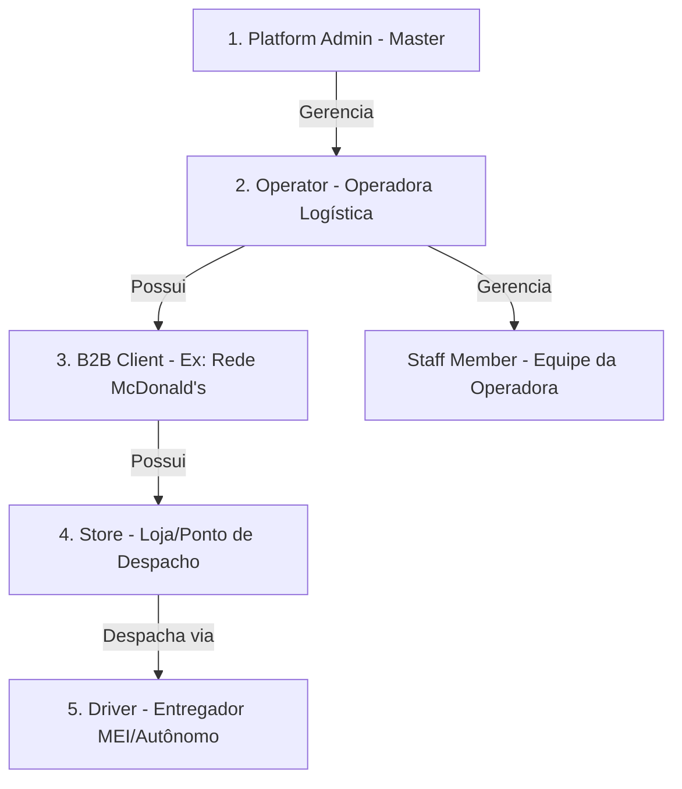
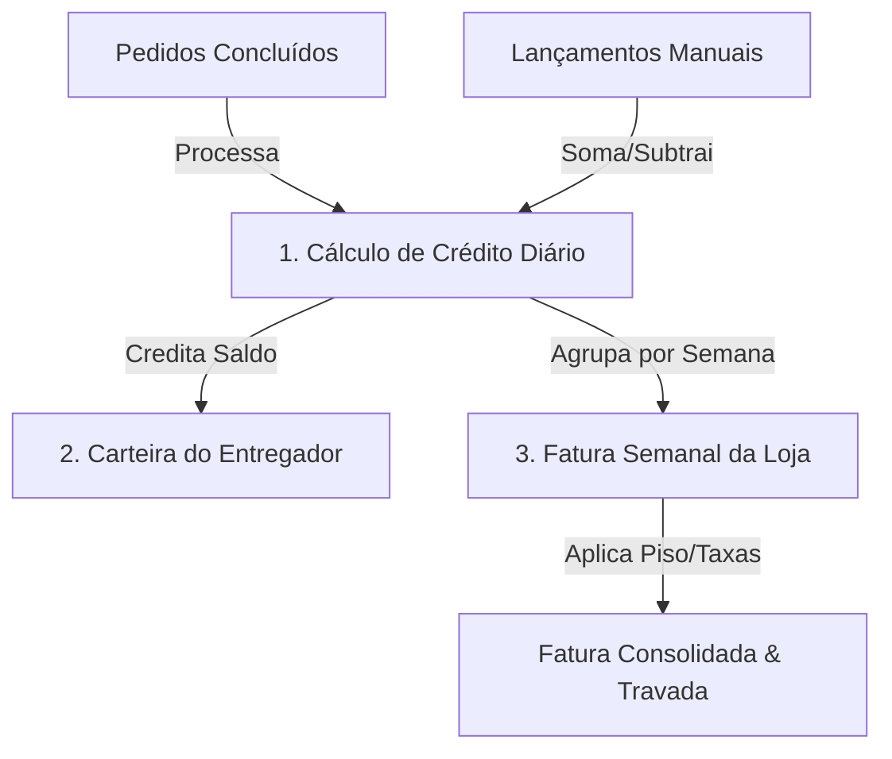

# Mapeamento Cirúrgico: Sistema de Logística de Entregas Expressas Multi-Tenant

Este documento descreve o mapeamento completo e detalhado das funcionalidades essenciais e avançadas necessárias para um sistema de logística de entregas expressas de altíssimo nível (Last-Mile Delivery / Quick Commerce), voltado a operadoras logísticas. O design arquitetônico considera uma estrutura **Multi-Tenant** integrada com **Django Rest Framework (DRF)** e **Supabase** (PostgreSQL, Realtime, Storage e Auth).

---

## 1. Arquitetura Multitenancy & Níveis de Acesso

Um sistema de logística profissional exige uma clara separação de escopos e permissões. A estrutura hierárquica ideal mapeada é:

### 1.1. Platform Admin (Master)
*   **Gestão de Operadoras (Tenants):** Cadastro, suspensão, trial, cancelamento e alteração de planos comerciais dos Operators (ex: Expresso Neves).
*   **Auditoria Global:** Log de auditoria unificado (`OperatorAuditLog`) registrando ações administrativas críticas (mudanças de contrato, ativação/desativação).
*   **Dashboard de Saúde:** Monitoramento global de volume de entregas, faturamento da plataforma e tempos médios de atendimento.

### 1.2. Operator Portal (Tenant Admin - Operadora Logística)
*   **Torre de Controle (Painel de Operações):** Tela de monitoramento em tempo real dos motoboys ativos, pedidos pendentes, manifestos em andamento e alarmes de atraso.
*   **Gestão de Clientes B2B & Lojas:** Configuração da estrutura corporativa dos parceiros comerciais.
*   **Motor de Contratos:** Configuração parametrizada e individualizada por loja (`Contract`), definindo as regras financeiras exatas (tabelas de km, faixas de horas, taxas administrativas).
*   **Gestão de Escala e Turnos:** Alocação de entregadores aos turnos das lojas no dia de competência financeira.
*   **Gestão de Pessoas (RH/DP):** Onboarding de motoristas, validação de documentos regulatórios (CNH, CRLV, MEI) e controle financeiro individual (Wallet).

### 1.3. Client Portal (Portal do Cliente B2B - ex: Franquia de Alimentação)
*   **Visibilidade Multiloja:** Acesso para gerentes regionais visualizarem todas as suas lojas físicas no mesmo painel.
*   **Criação de Pedidos:** Abertura manual de ordens de entrega ou integração via API comercial.
*   **Relatórios Financeiros:** Faturamento transparente, acesso a faturas semanais calculadas automaticamente pela operadora.

### 1.4. Store Dashboard (Loja Física - ex: McDonald's Unidade Centro)
*   **Despachante Exclusivo:** Visão focada no fluxo local de pedidos: Entrada, Preparo, Aguardando Entregador, Em Trânsito e Concluído.
*   **Mapa Live:** Rastreamento do motoboy que está vindo coletar ou que saiu para entrega.
*   **Integração ERP/POS:** Conectores com softwares de PDV/Delivery (ex: iFood, Delivery Direto) para criar pedidos automaticamente no backend.

### 1.5. Driver App (Aplicativo do Entregador)
*   **Check-in & Escala:** Indicação de presença no turno alocado (`ScheduleEntry`).
*   **Fila de Manifestos/Pedidos:** Recebimento de rotas agrupadas com sequência otimizada de paradas.
*   **Navegação Integrada:** Links dinâmicos para Google Maps e Waze.
*   **Comprovante Digital de Entrega (POD):** Foto da fachada/recebedor, assinatura digital na tela e leitura de código de barras/QR Code.
*   **Carteira Digital (Wallet):** Visualização detalhada do saldo, extrato de transações de crédito (diárias, extras) e débito (adiantamentos, multas).
*   **Painel de Conformidade:** Upload e renovação de documentos (CNH, Comprovante de MEI).

---

## 2. Motor Operacional & Roteirização (Dispatch Engine)

### 2.1. Gestão de Pedidos (Orders) e Paradas (Stops)
*   **Ciclo de Vida da Ordem:** Implementação de máquina de estados estrita:
    `PENDING` $\rightarrow$ `ACCEPTED` $\rightarrow$ `STARTED` (Saiu da loja) $\rightarrow$ `ARRIVED` (Chegou ao cliente) $\rightarrow$ `COMPLETED` / `CANCELED`.
*   **Suporte a Múltiplas Paradas:** Separação conceitual entre o Pedido (`Order`) e os pontos geográficos específicos (`Stop`), permitindo fluxo de *Coleta Múltipla* e *Entrega Múltipla* (Hub-and-Spoke).

### 2.2. Agrupamento e Roteirização Automática (Manifests)
*   **Agrupamento Inteligente (Co-loading):** Junção automática de pedidos com rotas compatíveis.
*   **Heurísticas de Otimização (2-Opt / Inserção):** Cálculo da sequência de paradas minimizando a quilometragem total e o tempo estimado de entrega (ETA).
*   **Restrições Parametrizadas em Contrato:**
    *   Máximo de paradas por manifesto (ex: até 4 paradas).
    *   Desvio geográfico máximo permitido (`maxDetourPercent`, ex: 20% do caminho original).
    *   Horário limite de corte para agrupamento (`cutoffHour`/`cutoffMinute`).

### 2.3. Rastreamento e Geofencing
*   **Streaming de Geolocalização:** Coleta e processamento de coordenadas em background pelo app do entregador, enviando ao backend Supabase.
*   **Cerca Virtual (Geofence):** Disparos automáticos de eventos (`GeofenceEvent`) quando o entregador entra ou sai de um raio delimitado (ex: 150m da loja ou do cliente), automatizando a transição de status para `ARRIVED` sem exigir ação manual no app.

---

## 3. Gestão de Recursos Humanos & Compliance (RH/DP)

Como operadoras trabalham majoritariamente com entregadores **autônomos (Pessoa Física)** ou **MEI**, o sistema precisa mitigar riscos jurídicos e operacionais:

### 3.1. Classificação Fiscal e Compliance
*   **MEI vs. Autônomo PF:** Tratamento distinto no cadastro para emissão de Recibos de Pagamento Autônomo (RPA) ou validação de Nota Fiscal de Serviços (MEI).
*   **Gestão de Documentos Regulatória:** Esteira de aprovação de documentos com data de vencimento (ex: CNH expirando bloqueia automaticamente o cadastro do entregador para novas escalas).

### 3.2. Frequência e Penalidades
*   **Controle de Faltas (`DriverAbsence`):** Registro de ausências programadas ou faltas não justificadas.
*   **Histórico de Performance (`DriverPerformanceNote`):** Elogios de clientes, advertências disciplinares e pontualidade.
*   **Escala Dinâmica:** Mudanças rápidas de motoboy escalado com log completo de quem realizou a troca (`ScheduleEntryAudit`), vital para evitar conflitos de "quem deveria estar trabalhando".

---

## 4. Motor Financeiro & Fechamento de Caixa

Este é o grande diferencial competitivo do sistema. Operações logísticas expressas exigem conciliação diária e faturamento semanal preciso.

### 4.1. Modos de Compensação de Contrato (B2B)
O motor calcula dinamicamente os repasses baseando-se em três modalidades principais configuradas no contrato da loja:
1.  **Produção (`PRODUCAO`):** Entregador recebe estritamente pelo que produz (valor fixo por entrega/parada + quilometragem calculada pelas faixas `KmFaixa`).
2.  **Garantida (`GARANTIDA`):** Valor fixo garantido pelo dia/turno trabalhado (ex: R$ 150,00 no domingo, R$ 120,00 na segunda), independentemente de fazer 1 ou 20 entregas.
3.  **Garantida Horas (`GARANTIDA_HORAS`):** Valor por hora de disponibilidade (calculado via `FaixaHoras` associadas ao turno real executado).

### 4.2. Parâmetros de Ajuste Financeiro da Loja
*   **Piso de Logística (`minimumRidesFeeFloor`):** Valor mínimo que a operadora cobra da loja na semana (ex: mínimo de R$ 350,00 de faturamento de frete para manter a operação dedicada ativa).
*   **Piso Percentual (`minimumFloorPercent`):** Garante margem operacional mínima da operadora sobre o faturamento total da loja.
*   **Taxa Administrativa Progressiva:** Aplicação de taxa fixa ou percentual caso o faturamento exceda determinado patamar (`adminTaxThreshold`).
*   **Taxa de Supervisão:** Cobrança de valor fixo semanal de supervisão logística de campo.

### 4.3. Wallet & Crédito Diário (Entregadores)
*   **Fechamento Diário Automatizado:** Todo dia à noite (conforme `cutoffHour`/`cutoffMinute`), o motor roda e processa as corridas e escalas do dia, consolidando o `DailyCreditCalculation` de cada entregador.
*   **Transações de Wallet:** O saldo calculado é convertido em centavos (`balanceCents`) para evitar erros de ponto flutuante e imputado na carteira (`WalletTransaction`).
*   **Ajustes Manuais e Adiantamentos:** Lançamento de vales, descontos por quebra de baú/acidente, ou bônus por chuva direta na carteira.

### 4.4. Faturamento Semanal B2B (Lojas)
*   **Ciclo Fechado (Segunda a Domingo):** Geração automática na segunda-feira subsequente das faturas de rascunho (`WeeklyStoreInvoice`).
*   **Detalhamento da Fatura (Line Items):** Itemização transparente dia a dia, entregador por entregador, provando todos os cálculos aplicados de produção, extras, taxas e pisos aplicados.
*   **Status de Fatura:** `DRAFT` (Ajustes de auditoria) $\rightarrow$ `PROCESSING` $\rightarrow$ `FINALIZED` $\rightarrow$ `LOCKED` (Fatura travada comercialmente, impede qualquer edição de ordens retroativas).

---

## 5. Integração Tecnológica: Django DRF + Supabase

Para entregar uma experiência de altíssimo nível, o backend utilizará a sinergia entre o poder do Django Rest Framework (DRF) e os serviços do Supabase.

### 5.1. Divisão de Responsabilidades
*   **Supabase PostgreSQL:** Banco de dados relacional principal.
*   **Supabase Auth:** Autenticação unificada (JWT) gerenciada pelo Supabase. O Django valida e extrai claims do JWT (utilizando middlewares adaptados para Supabase Auth).
*   **Supabase Storage:** Armazenamento seguro de fotos de comprovantes de entrega (`Proof`) e PDFs de documentos de motoristas (`DriverDocument`).
*   **Supabase Realtime:** Transmissão imediata de coordenadas GPS do entregador e mudanças de status de pedidos diretamente para a tela de monitoramento da torre de controle (sem necessidade de polling HTTP pesado no Django).
*   **Django DRF (Business Logic Engine):**
    *   Regras de negócio complexas de cálculo financeiro (motor de contratos, faturamento semanal, fechamento diário de wallet).
    *   Algoritmos de roteirização e agrupamento automático de pedidos.
    *   Máquina de estados de ordens e validações de integridade transacional.
    *   APIs RESTful seguras e estruturadas para integrações externas (iFood, POS).

### 5.2. Mecanismo de Multitenancy no Django
Para garantir isolamento de dados absoluto e performance:
1.  **Row Level Security (RLS) no Supabase:** Configuração de políticas de segurança na camada do PostgreSQL onde cada query filtre obrigatoriamente pelo `operatorId` vindo do JWT de autenticação.
2.  **Multitenant Middleware no Django:** Injeção do `operator_id` no contexto global de cada request (através do parser de token do Supabase), aplicando filtros automáticos nos managers dos modelos Django (ex: `OperatorModel.objects.filter(operator_id=tenant_id)`).

---

## 6. Diferenciais Premium de Altíssimo Nível (WOW Effects)

1.  **Live Dispatch Tracker (Visualização para Clientes):** Interface web para o cliente final do delivery acompanhar o entregador no mapa (estilo Uber/iFood), com micro-animações de carro/moto se deslocando e barra de progresso do status da entrega.
2.  **Motor de Sugestão de Escalas com IA:** Algoritmo que sugere alocação de entregadores com base no histórico de assiduidade de faltas e proximidade geográfica da loja.
3.  **Fechamento Financeiro de "1-Clique":** Geração, conciliação e exportação de faturas em PDF e layouts de pagamento bancário (CNAB) para quitação em massa dos motoboys via PIX.
4.  **Modo Offline First no App do Motoboy:** Permite realizar paradas e coletar assinaturas/fotos mesmo sem conexão à rede, sincronizando os dados e o tracking GPS em batch assim que o sinal for restabelecido.
