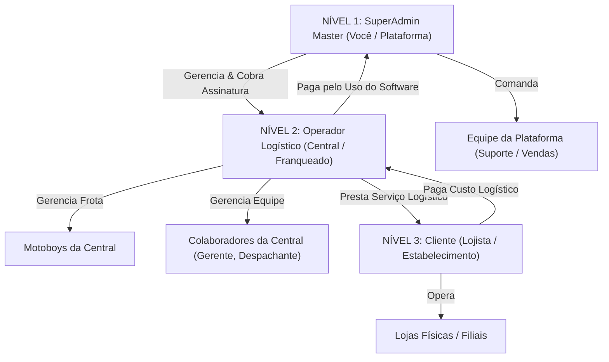

# Especificação Técnica: Controle de Acesso e Permissões em 3 Níveis (SuperAdmin Master, Operador Logístico e Lojista)

**Data:** 2026-09-17  
**Status:** Aprovado para Execução  
**Contexto:** Correção e refinamento profundo do sistema de permissões e controle de acesso hierárquico na plataforma Expresso Neves, diferenciando com precisão os 3 tiers do negócio: SuperAdmin Master (Plataforma), Operador Logístico (Hub/Central) e Cliente (Lojista).

---

## 1. Visão Geral da Hierarquia de 3 Níveis

### Definição dos Níveis e Responsabilidades:

| Nível | Entidade | Descrição | Modelo de Cobrança |
|---|---|---|---|
| **1. SuperAdmin Master** | `PlatformAdmin` | Soberano global. Gerencia a plataforma, todos os operadores logísticos, configurações globais, integrações e equipe de suporte/comercial da plataforma. | Recebe mensalidade/licença dos Operadores. |
| **2. Operador Logístico** | `StaffMember` (com `operator_id`) | Central de logística / franquia. Gerencia sua própria frota de motoboys, cadastra suas empresas/lojas clientes, suas tabelas de preços, escalas, faturamento operacional e saques dos motoboys. | Paga taxa de uso ao SuperAdmin; cobra dos lojistas pelo serviço de entrega. |
| **3. Cliente (Lojista)** | `ClientPortalUser` (com `client_id` e `operator_id`) | Dono ou gerente do estabelecimento comercial. Lança pedidos de entrega, rastreia motoboys ao vivo e consulta o extrato das suas corridas e faturas a pagar ao Operador. | Paga o valor das corridas e diárias ao Operador Logístico. |

---

## 2. Matriz de Permissões e Menus por Perfil

| Rota / Recurso | SuperAdmin Master (`superadmin`) | Operador Admin / Gerente (`operador_admin`) | Operador Despachante (`operador_staff`) | Cliente / Lojista (`lojista`) |
|---|:---:|:---:|:---:|:---:|
| **Dashboard** (`/`) | Visão Global (todas centrais) | Visão da Central | Visão Operacional | Visão da Loja (Pedidos do dia) |
| **Corridas / Ao Vivo** (`/corridas`) | Monitoramento Global | Despacho e Gestão da Central | Despacho e Atribuição | Rastreamento dos Próprios Pedidos |
| **Lançar Corrida** | Sim | Sim (em nome das lojas) | Sim | Sim (Sua Loja) |
| **Escala** (`/escala`) | Sim | Gestão de Escala da Frota | Consulta de Escala | ❌ Bloqueado |
| **Motoboys** (`/motoboys`) | Visão Global | Gestão Total da Frota Local | Consulta de Status | ❌ Bloqueado |
| **Empresas / Lojas** (`/empresas`) | Todas as Lojas | Lojas Clientes da Central | ❌ Bloqueado | ❌ Bloqueado |
| **Usuários** (`/usuarios`) | Equipe Master & Admins | Equipe da Central & Lojistas | ❌ Bloqueado | ❌ Bloqueado |
| **Lançamentos** (`/lancamentos`) | Global | Lançamentos da Central | ❌ Bloqueado | Extrato da Loja |
| **Financeiro** (`/financeiro`) | Cobrança dos Operadores | Faturamento das Lojas & Motoboys | ❌ Bloqueado | Faturas da Loja |
| **Saques PIX** (`/saques`) | Auditoria Geral | Aprovação de Saques da Frota | ❌ Bloqueado | ❌ Bloqueado |
| **Relatórios** (`/relatorios`) | Relatórios Globais | Relatórios da Operação | Relatórios Básicos | Relatórios de Entregas da Loja |
| **Histórico** (`/historico`) | Histórico Global | Histórico da Central | Histórico da Central | Histórico da Loja |
| **Operadores** (`/operadores`) | **EXCLUSIVO SUPERADMIN** | ❌ Bloqueado | ❌ Bloqueado | ❌ Bloqueado |
| **Gerencial** (`/gerencial`) | **EXCLUSIVO SUPERADMIN** | ❌ Bloqueado | ❌ Bloqueado | ❌ Bloqueado |
| **Snapshots** (`/snapshots`) | **EXCLUSIVO SUPERADMIN** | ❌ Bloqueado | ❌ Bloqueado | ❌ Bloqueado |
| **Sync** (`/sync`) | **EXCLUSIVO SUPERADMIN** | ❌ Bloqueado | ❌ Bloqueado | ❌ Bloqueado |
| **Configurações** (`/configuracoes`) | Configuração da Plataforma | Configuração da Central | ❌ Bloqueado | Perfil da Loja |

---

## 3. Modelo de Autenticação e Payload JWT

### 3.1 Unificação no Endpoint de Login (`/api/v1/auth/login`)
A função `handle_login` passa a autenticar em ordem:
1. `PlatformAdmin`: Se encontrado com senha válida:
   - `role`: `"superadmin"`
   - `user_type`: `"platform_admin"`
   - `is_platform_admin`: `True`
   - `operator_id`: `None`
   - `company_id`: `"global"`
   - `companies`: Lista com `"global"` + todos os Operadores.
2. `StaffMember`: Se encontrado com senha válida:
   - `role`: `"operador_admin"` (para `ADMIN`/`MANAGER`) ou `"operador_staff"` (para `OPERATOR_ROLE`/`VIEWER`).
   - `user_type`: `"operator_staff"`
   - `is_platform_admin`: `False`
   - `operator_id`: `str(staff.operator_id)`
   - `companies`: Lojas pertencentes ao operador.
3. `ClientPortalUser`: Se encontrado com senha válida:
   - `role`: `"lojista"`
   - `user_type`: `"client_portal_user"`
   - `is_platform_admin`: `False`
   - `operator_id`: `str(client_user.operator_id)`
   - `client_id`: `str(client_user.client_id)`
   - `companies`: Apenas as lojas deste cliente (`client_id`).

### 3.2 Endpoint `/api/v1/auth/me`
Garante os mesmos metadados (`role`, `is_platform_admin`, `user_type`, `operator_id`, `client_id`) em reloads e verificações de sessão.

---

## 4. Escopo de Dados no Backend (Isolamento Multi-Tenant)

### 4.1 Endpoints de Dados (`db_api.py` e `panel_api.py`)
- **SuperAdmin Master (`is_platform_admin=True`)**:
  - Se `company_id == "global"`, retorna dados agregados de todos os operadores.
  - Se `company_id` for um UUID específico, filtra para aquele operador selecionado.
- **Operador Logístico (`user_type == "operator_staff"`)**:
  - Todas as consultas aplicam estritamente `operator_id = request.auth.get("operator_id")`.
  - Impede acesso a qualquer tela de `/operadores`, `/sync`, `/snapshots`.
- **Lojista (`user_type == "client_portal_user"`)**:
  - Pedidos: apenas pedidos onde `store__client_id = request.auth.get("client_id")`.
  - Lojas: apenas lojas onde `client_id = request.auth.get("client_id")`.
  - Bloqueio completo de endpoints de frota de motoboys, saques PIX e criação de operadores.

---

## 5. Frontend Adaptativo (`AppLayout.tsx`)

### 5.1 Estrutura de Menus Adaptativa
O `AppLayout.tsx` utiliza as novas roles normalizadas:
- `"superadmin"`: vê grupos "Operacional Global", "Gestão de Operadores", "Financeiro Master", "Sistema e Infraestrutura".
- `"operador_admin"` / `"operador_gerente"`: vê "Operacional Local" (Dashboard, Corridas, Escala), "Gestão da Central" (Motoboys, Empresas, Equipe), "Financeiro da Operação" (Lançamentos, Faturamento, Saques PIX, Relatórios), "Configurações da Central".
- `"lojista"`: vê "Minha Loja" (Dashboard da Loja, Corridas/Chamar Motoboy, Histórico), "Financeiro" (Faturas/Extrato da Loja), "Configurações" (Perfil da Loja).

### 5.2 Route Guards Rígidos
Proteção client-side para evitar navegação manual via URL para rotas não autorizadas, redirecionando o usuário para a sua página inicial permitida.
