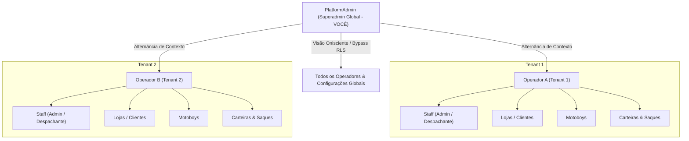

# Especificação Técnica: Banco de Dados PostgreSQL Puro na VPS & Autenticação Nativa Superadmin Multi-Tenant

**Data:** 2026-09-17  
**Status:** Proposto para Aprovação  
**Contexto:** Desacoplamento total do Supabase em favor de infraestrutura PostgreSQL 17 + PostGIS 3.5 hospedada na VPS, acompanhado de autenticação nativa JWT no Django Ninja com soberania global de Superadmin (PlatformAdmin) sobre todos os Tenants (Operators).

---

## 1. Visão Geral e Hierarquia de Soberania Multi-Tenant

O sistema opera no modelo multi-tenant isolado por operador logístico (`Operator`), mas com uma camada suprema de gestão que confere ao **PlatformAdmin (Você / Dono da Plataforma)** visibilidade e autoridade irrestrita:



### Regras de Acesso e Governança
1. **PlatformAdmin (Superadmin Global)**:
   - Identidade master gravada na tabela `PlatformAdmin`.
   - `operator_id` é opcional/nulo ou assume valor `"global"`.
   - Pode criar, suspender e auditar qualquer `Operator`.
   - No painel frontend, possui o seletor de tenant que permite navegar em qualquer loja, motoboy, corrida ou extrato financeiro de qualquer operador, ou visualizar métricas consolidadas globais.
2. **StaffMember (Equipe do Tenant)**:
   - Pertence estritamente a um `operator_id` (`ADMIN`, `MANAGER`, `OPERATOR_ROLE`, `VIEWER`).
   - Acesso estritamente restrito aos dados do seu próprio operador.
3. **Store / ClientPortalUser**:
   - Pertence a um cliente/loja de um operador logístico.
4. **Driver (Entregador)**:
   - Pertence a um operador logístico específico.

---

## 2. Infraestrutura e Banco de Dados (PostgreSQL + PostGIS VPS)

### Conexão e Variáveis
* Host interno (VPS Docker Network): `expresso_neves_postgres:5432`
* Host externo (Dev / Migrations locais): `191.101.235.244:5433`
* Banco: `expresso_neves` | Usuário: `postgres`
* Senha URL-encoded: `Al147258%40%23`
* Imagem Docker ativa: `postgis/postgis:17-3.5` (testada e validada com PostGIS 3.5.2 e uuid-ossp).

### Execução de Migrações e Construção das Tabelas
Será executado o runner de migrações sequencial que aplica as 16 migrações SQL existentes em `supabase/migrations/`:
1. Criação das extensões `uuid-ossp` e `postgis`.
2. Criação dos enums de negócio (`order_status`, `role_type`, `wallet_transaction_category`, `daily_credit_status`, etc.).
3. Tabelas de infraestrutura (`Operator`, `PlatformAdmin`, `OperatorAuditLog`, `StaffMember`, `SecurityDenylist`).
4. Tabelas logísticas (`Store`, `StoreLocation`, `Driver`, `Order`, `OrderStop`, `Manifest`, `RiskZone`, `TrackingEvent`).
5. Tabelas financeiras e de alçada de saque (`Wallet`, `OperatorInternalWallet`, `WalletTransaction`, `DailyCreditCalculation`, `WeeklyStoreInvoice`, `WithdrawalRequest`, `PayoutPolicyConfig`).
6. Triggers de atualização automática de `updatedAt` e bloqueio de saques para condutores em denylist.

---

## 3. Autenticação Nativa no Backend (Django Ninja JWT)

Substituição da camada externa do Supabase por um motor de autenticação proprietário, rápido e seguro:

### Modelos de Dados
* Adicionar campo de credencial local aos modelos de usuário:
  ```python
  password_hash = models.CharField(max_length=255, null=True, blank=True, db_column="passwordHash")
  ```
* Implementação dos métodos `set_password(raw_password)` e `check_password(raw_password)` com PBKDF2-SHA256 padrão Django.

### Endpoints da API (`/api/auth/`)
1. **`POST /api/auth/login`**:
   - Entrada: `{ "email": "...", "password": "..." }`
   - Busca em `PlatformAdmin`, depois em `StaffMember`, depois em `ClientPortalUser`.
   - Valida `check_password(password)`.
   - Gera par de tokens JWT:
     - `access_token` (vida útil 8 horas):
       - Claims: `{ "sub": user_id, "email": email, "name": name, "role": "admin"|"manager"|..., "is_platform_admin": true|false, "operator_id": str(operator_id)|"global" }`
     - `refresh_token` (vida útil 30 dias).
   - Retorna: `{ "access_token": "...", "refresh_token": "...", "user": { ... } }`
2. **`GET /api/auth/me`**:
   - Retorna o perfil completo do usuário autenticado.
   - Para o **PlatformAdmin**, injeta a lista de todos os operadores da plataforma para permitir a alternância de contexto (tenant switching).
3. **`POST /api/auth/refresh`**:
   - Valida o refresh token e emite novo access token.
4. **`POST /api/auth/logout`**:
   - Invalidação no frontend e blacklist opcional em cache Redis.

### Camada de Autorização (Bearer Token)
* `NativeJWTAuth(HttpBearer)`:
  - Decodifica e valida a assinatura do token usando `DJANGO_SECRET_KEY`.
  - Injeta `request.auth` com as claims do usuário.
* `require_role(roles)` e `platform_admin_required`:
  - `platform_admin_required`: Garante que apenas o Superadmin (`is_platform_admin == True`) execute comandos de infraestrutura global.
  - Se o Superadmin acessar uma rota de operador, ele tem permissão total (bypass de tenant automático).

---

## 4. Frontend: Desacoplamento Completo do Supabase

1. **Eliminação do `@supabase/supabase-js`**:
   - Criação de `frontend/src/lib/auth.ts` contendo funções nativas `loginApi(email, password)`, `logoutApi()`, `refreshTokenApi()`.
2. **[`Login.tsx`](file:///c:/Users/lxleo/Documents/Expresso%20Neves/Painel%20Expresso%20Neves%20e%20Django%20DRF/frontend/src/pages/Login.tsx)**:
   - Formulário de login chama diretamente `loginApi()`.
   - Salva o token JWT em `localStorage.setItem("nevesgo:token", data.access_token)`.
3. **[`AuthContext.tsx`](file:///c:/Users/lxleo/Documents/Expresso%20Neves/Painel%20Expresso%20Neves%20e%20Django%20DRF/frontend/src/contexts/AuthContext.tsx)**:
   - Inicializa checando se há token local válido chamando `/api/auth/me`.
   - Permite que você (Superadmin) alterne dinamicamente entre "Administração Global" e qualquer operador específico via dropdown no topo da aplicação.
4. **[`authFetch`](file:///c:/Users/lxleo/Documents/Expresso%20Neves/Painel%20Expresso%20Neves%20e%20Django%20DRF/frontend/src/lib/api.ts)**:
   - Injeta o `Authorization: Bearer <token>` extraído do `localStorage`.

---

## 5. Script Seed do Primeiro Superadmin (Você)

Criação do comando Django `python manage.py create_platform_admin`:
- Parâmetros: `--email`, `--name`, `--password`.
- Insere registro na tabela `PlatformAdmin` com senha criptografada via PBKDF2.
- Permite que você faça login imediato na plataforma com acesso total a tudo.

---

## 6. Plano de Validação e Testes
1. Conectar e aplicar todo o schema SQL no PostgreSQL PostGIS da VPS.
2. Criar o Superadmin via comando seed.
3. Testes unitários do motor de login, JWT e proteção de rotas com pytest.
4. Teste de login end-to-end com credenciais master.
5. Validação da suite completa (117+ testes backend) e build do frontend sem erros.
